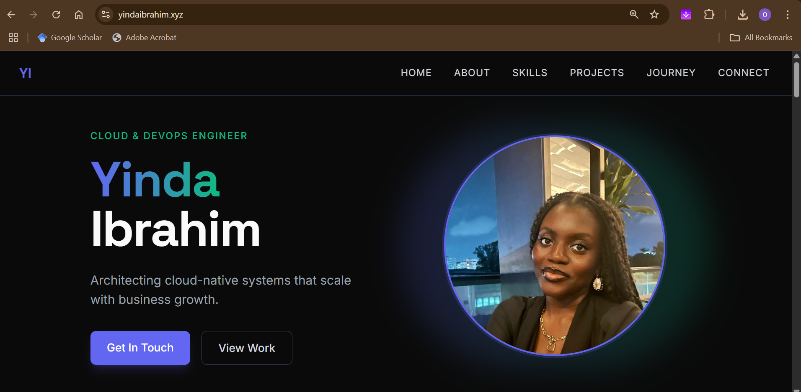

# AltSchool Cloud Engineering Exam Project: Professional Web Server Deployment

**Name:** Oyindamola Ibrahim  
**AltSchool ID:** ALT/SOE/024/5808. 
**Program:** Cloud Engineering (Tinyuka 2024)

---

## Project Title: Mentli – The Future of Peer-to-Peer Business Coaching

This project demonstrates full-cycle cloud engineering by deploying a secure, scalable web application on AWS EC2. It involves a custom landing page hosted via an Nginx reverse proxy, backed by a Node.js server, and configured with production-ready features.

Mentli is a cloud-native platform concept that connects entrepreneurs for structured peer coaching. This project simulates a real-world SaaS deployment workflow — from server provisioning and configuration to app deployment and security hardening.

---

## Live Deployment

- **Public IP:** [http://16.171.24.246](http://16.171.24.246)
- **Secure Endpoint:** *(SSL not yet configured – domain pending)*



---

## Technical Implementation

### 1. Infrastructure Provisioning

- EC2 instance running Ubuntu 22.04 LTS (Free Tier eligible)
- Provisioned using SSH key (`altschool-key.pem`)
- Security group configured to allow:
  - Port 22 (SSH) for remote access
  - Port 80 (HTTP) for web traffic
  - Port 443 (HTTPS) for SSL (planned)

### 2. Web Server Setup

- Installed and configured Nginx as a reverse proxy
- Node.js app running on port `3000`
- Nginx forwards incoming traffic to the Node.js app
- Static files (HTML, CSS, images) served from `/public` directory

### 3. Application Deployment

- Built a responsive landing page using HTML5 and TailwindCSS
- Integrated subtle CSS animations for smooth transitions
- Backend: Node.js + Express for routing and serving static content
- PM2 is used to manage and persist the app process across reboots

### 4. Security Configuration

- UFW firewall configured to allow only essential ports
- Nginx headers added for basic protection:
  ```nginx
  add_header X-Frame-Options "SAMEORIGIN";
  add_header X-Content-Type-Options "nosniff";
  add_header Strict-Transport-Security "max-age=63072000" always;
  ```

---

## Troubleshooting & Lessons Learned

| Problem | Resolution |
|--------|-------------|
| Node.js not responding on curl | Ensured app bound to `0.0.0.0` instead of `localhost` |
| EC2 refused SSH connection | Corrected PEM key permissions with `chmod 400` |
| Static image not loading | Used `scp` to copy image into `/public` directory |
| Nginx not showing latest file | Cleared browser cache and reloaded server |
| PM2 restarting frequently | Checked logs with `pm2 logs` and resolved syntax errors |

---

## Project Concept: Mentli

**Pitch:**  
Traditional mentorship is often unstructured and difficult to scale. Mentli introduces a cloud-native solution where business coaching becomes a two-sided marketplace—entrepreneurs can monetize their experience while founders receive targeted, actionable advice.

**Why It Matters:**  
- Converts lived experience into economic value  
- Enables distributed, on-demand mentorship  
- Built on scalable, secure cloud infrastructure

---

## Future Enhancements

- Acquire a domain name and secure the app using Let's Encrypt SSL (Certbot)
- Add CI/CD automation using GitHub Actions
- Enable logging and metrics with AWS CloudWatch or Prometheus
- Use Docker and ECS for containerized, scalable deployments

---

## Directory Structure

```
mentli/
├── index.js                # Express server
├── public/
│   ├── index.html          # Landing page
│   ├── style.css           # Tailwind styles
│   └── pfp.jpg             # Static image
├── pm2.config.js
├── package.json
└── README.md
```

---

## Submission Details

- **GitHub Repo:** [https://github.com/YOUR_USERNAME/mentli](https://github.com/YOUR_USERNAME/mentli)
- **Public IP:** [http://16.171.24.246](http://16.171.24.246)
- **Student:** Oyindamola Ibrahim
- **Program:** Cloud Engineering (Tinyuka 2024)
- **Submission Date:** [Insert Date]

All setup and troubleshooting steps are detailed above. Logs and command history available upon request.

---

Oyindamola Ibrahim  
Cloud & DevOps Engineer  
AltSchool Africa
